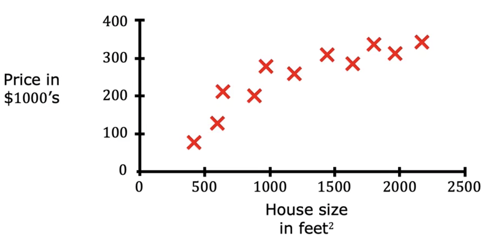
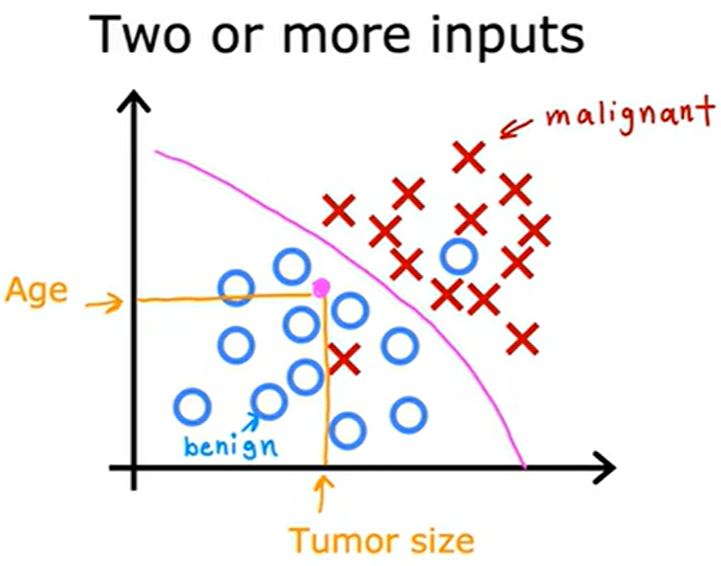
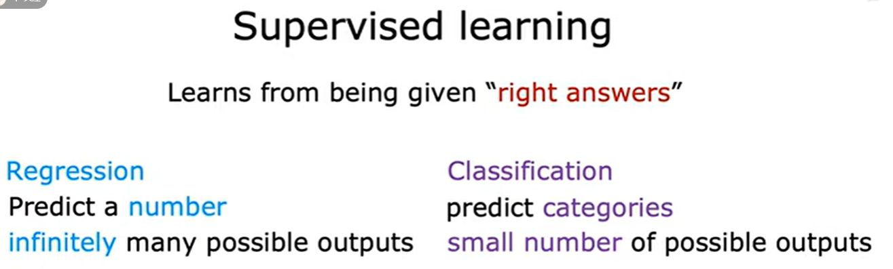

1.2 Types of Machine Learning
=============================

Machine learning is a subfield of artificial intelligence. There are several types of machine learning algorithms, including i) supervised learning, ii) unsupervised learning, iii) semi-supervised learning, iv) reinforcement learning. 

Supervised learning algorithms are trained using labeled data, where the algorithm is given input data along with the correct output. The goal of supervised learning is to learn a mapping between the input features and the target variable, so that the model can predict the target variable for new, unseen examples. This type of learning is commonly used in tasks such as image classification, speech recognition, and natural language processing.

Unsupervised learning algorithms, on the other hand, are trained on unlabeled data, where the algorithm is tasked with finding patterns and relationships in the data. 
Instead, the goal of unsupervised learning is to learn the underlying structure or patterns in the data. This type of learning is commonly used in tasks such as clustering, anomaly detection, and dimensionality reduction.

Semi-supervised learning is a combination of supervised and unsupervised learning, where a model is trained on a dataset that contains both labeled and unlabeled examples. The goal of semi-supervised learning is to leverage the labeled examples to improve the performance of the model on the unlabeled examples. This type of learning is commonly used in scenarios where labeled data is scarce or expensive to obtain.

Reinforcement learning algorithms are designed to learn through trial and error, where the algorithm receives feedback in the form of rewards or punishments based on its actions and adjusts its behavior accordingly. The goal of reinforcement learning is to learn a policy that maximizes the expected cumulative reward over time. This type of learning is commonly used in tasks such as game playing, robotics, and autonomous driving.

1.2.1 Supervised Learning
----------------------------------------
Supervised machine learning, more commonly supervised learning, refers to algorithms that learn the mappings from given input **X** and output label **Y**. The key characteristics of supervised learning is that a set of inputs and corresponding labeled outputs must be provided in order for algorithms to learn patterns or relationships from the inputs to the outputs. The process of learning from these "right answers", i.e., the correct pairs of input **X** and the desired output label **Y**, is called training. Once trained, the algorithm can then be used to predict the output values for new, unseen input features. Supervised learning is widely used in a range of applications such as spam filtering, machine translation, image recognition, speech recognition, and natural language processing. The goal of supervised learning is to build a model that can accurately generalize to new data, based on what it has learned from the labeled training dataset.

There are two major types of supervised learning: regression and classification. Let's dive more deeply into two specific examples.

**Regression: House price prediction** 

Suppose you want to predict the house prices based on the size of the house. You have collected some data and plotted them in :numref:`fig:house-price`. The sizes of house for these scattered points are the input, and their corresponding prices are the labeled data. The learning process is about finding a straight line or curve that best fits these scattered points, so-called supervised learning. After learning from these data, for a given house size, we can obtain the appropriate house price. This particular type of supervised learning is called regression, i.e., predicting a number (the proper house prices) from infinitely many possible outputs (all possible house prices).

   
   House prices with respect to its size.

**Classification: Breast cancer detection** 

Let's take breast cancer detection as an example of classification problem. Assume you are build a machine learning system to help doctors diagnose breast cancer. Early detection is very important for detecting breast cancer by figuring out whether the tumor is malignant or benign, which can save patients' lives. The task is to make your diagnosis based on the size of the tumor, i.e., malignant or benign. The collected data will be shown in the :numref:`tab:breast`, where the left column represents the size of the tumor and the right column shows the corresponding diagnosis, benign (0) or malignant (1). As you can see, there is a big difference with regression tasks in that only a few possible outputs can be predicted in classification task, for instance, only two values 0 and 1 are predicted in this task. Of course, you can have more than two output classes or categories in classification problems, commonly written as integers 0, 1, 2, ..., and one for each category. Similarly, you can also have more than one input value in classification problems, for instance, in the following :numref:`fig:breast-detection`, both tumor size and patients' age are considered as the input features. 

.. list-table:: Data samples for breast cancer detection
   :name: tab:breast
   :widths: 50 50
   :header-rows: 1
   :align: center

   * - **Tumor Size [cm]**
     - **Diagnosis (0/1)**
   * - 2 
     - 0
   * - 1
     - 0
   * - 5
     - 1
   * - 3
     - 0
   * - 7
     - 1
   * - ...
     - ...

   
   Breast cancer classification with respect to tumor size and patients' age.

**To recap:** Supervised Learning maps input X to output Y, where the learning algorithm learns from the "right answers". Two major types of supervised learning are: regression and classification.

1.2.2 Unsupervised Learning
----------------------------------------

1.2.3 Semi-supervised Learning
----------------------------------------

1.2.4 Reinforcement Learning
----------------------------------------

